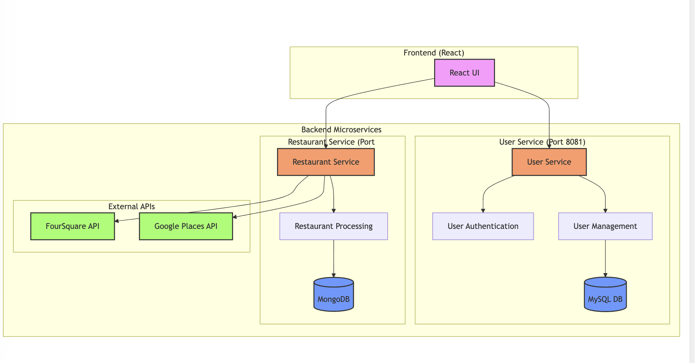
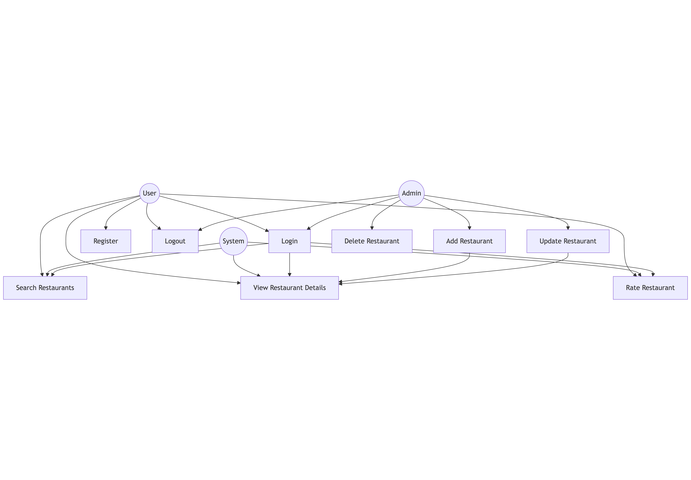

Restaurant Finder public IP in AWS: http://18.118.189.201:3000/

---

### The Team

**Frontend**:  
- Jinwoo Bae  
- Shanmukha ManojKakani  

**Backend**:  
- Aditya Rao  
- Nikhil Koli
- [Project_Sprint Task Timeline - Sheet1.pdf](https://github.com/user-attachments/files/18031545/Project_Sprint.Task.Timeline.-.Sheet1.pdf)

---

### Team Contribution Summary

**Jinwoo Bae**:  
- Designed and implemented the React frontend.  
- Developed front-end components: Home, Search, and User Profile.  
- Integrated the frontend with backend APIs and styled the application for user-friendly navigation.

**Shanmukha Kakani**:  
- Ensured state management and responsiveness of the frontend.  

**Aditya Rao**:  
- Developed backend services for the user module.
- Integrated user service with the frontend.
- Handled database interactions and deployment of user-service MySQL in RDS.
- Role based handling in UI for admin, business-owner and customer.

**Nikhil Koli**:  
- Developed backend services for restaurant management and integrated with mongo.  
- Integrated restaurant service with the frontend.  
- Built APIs for restaurant search, booking, and feedback handling.
- Dockerised all the services

## Sprint Notes (Design Decisions)

| Team Members          | Hours per Week |
|------------------------|----------------|
| Jinwoo Bae            | 10 hours       |
| Shanmukha Manoj Kakani| 10 hours       |
| Aditya Rao            | 10 hours       |
| Nikhil Koli           | 10 hours       |
| **Total Hours**       | **40 hours**   |

---

### Meeting Details

| Question                     | Answer                            |
|------------------------------|------------------------------------|
| How many weeks per sprint?   | 2 weeks                          |
| Mode of scrum meetings       | Online Discord Calls (Tue, Thu, Fri) |
| Communication Channel        | Discord                          |

### 1. Sprint Meeting 1 (9/15)
In the first sprint, the team focused on laying the foundation for the application by designing its architecture and initiating database setup. Aditya Rao worked on the MySQL schema for the User Service and set up an AWS RDS instance, while Nikhil Koli created the MongoDB schema for the Restaurant Service and configured its deployment on Atlas. On the frontend side, Jinwoo Bae established the initial React application, integrating essential libraries and designing a basic UI for login and registration. Meanwhile, Shanmukha Manoj Kakani led the effort to draft the architecture and activity diagrams, providing a high-level understanding of the project's flow. These activities collectively established a strong foundation for future development.

---

### 2. Sprint Meeting 2 (10/2)
The second sprint was dedicated to API development and integration. Aditya Rao and Nikhil Koli made significant progress on the backend, with Aditya developing the User Service APIs to handle user creation and retrieval and Nikhil building APIs to manage restaurant data. The frontend team connected the React application with the backend services, enabling seamless functionality for user login and registration. This sprint marked a crucial step in ensuring the components worked cohesively, paving the way for enhanced features in the next phases.

---

### 3. Sprint Meeting 3 (10/23)
During the third sprint, the team shifted focus to refining features and improving user experience. The restaurant search functionality was developed and integrated with MongoDB, while new endpoints were created for handling user reviews and ratings. Business rules, such as validation checks and duplicate entry prevention, were implemented to ensure data integrity. Thorough testing of both unit and integration levels was carried out to verify the reliability of APIs and the frontend's compatibility, marking substantial progress toward a robust application.

---

### 4. Sprint Meeting 4 (11/12)
The final sprint concentrated on deployment and fine-tuning the application. Backend services were successfully deployed on AWS using EC2 instances for scalability and RDS for reliable database performance. The frontend team improved error handling, refined UI elements, and resolved any remaining bugs. Comprehensive end-to-end testing was conducted to ensure all features worked seamlessly. With all components integrated and tested, the project was finalized and prepared for submission, showcasing a complete and polished application.

## XP Core Values

### Simplicity
The team focused on developing only the most important features during each sprint, adhering to the simplicity concept. The backend team created simple, modular microservices for user and restaurant management that were easy to expand if necessary, rather than over-engineering solutions. By putting usability ahead of needless complication, the frontend team produced a simple and easy-to-use user interface. The team was able to create a scalable and functional application on schedule by maintaining a minimal architecture.

### Feedback
To raise the overall caliber of the application, the team aggressively solicited input from one another throughout the development process. Team members assessed finished features, including the restaurant search and user authentication system, during sprint reviews and offered helpful recommendations for improvements. Frequent testing and incremental enhancements made that the program worked as intended and fulfilled user expectations. The team was able to improve their work and produce a polished end result by placing a strong emphasis on feedback.
## System Diagrams

### Architecture Diagram

### Activity Diagram 

### Component Diagram
