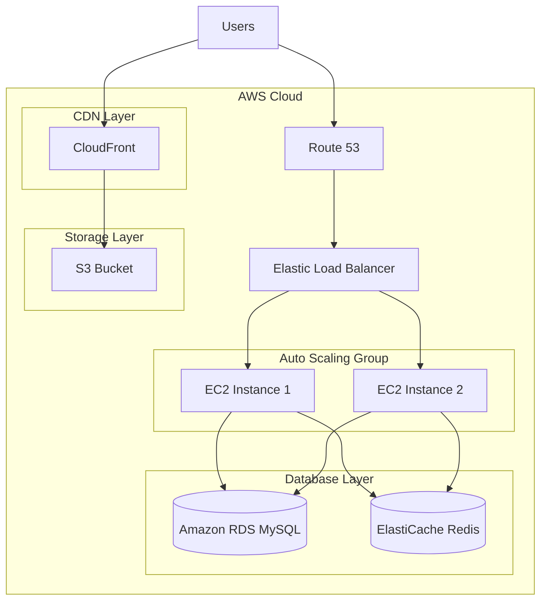
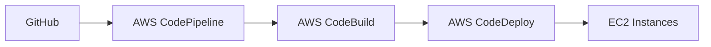

# AWS Deployment Strategy for Restaurant Finder Application

## 1. Architecture Overview

## 2. AWS Services Used

### 2.1 Compute Layer
- **Amazon EC2**
  - t2.medium instances for application servers
  - Auto Scaling Group (2-4 instances)
  - Custom AMI with Java 11 and application dependencies

### 2.2 Database Layer
- **Amazon RDS (MySQL)**
  - db.t3.medium instance
  - Multi-AZ deployment for high availability
  - Automated backups enabled
  - Performance Insights enabled

### 2.3 Caching Layer
- **Amazon ElastiCache (Redis)**
  - For session management
  - Caching frequent database queries
  - Restaurant ratings cache

### 2.4 Storage Layer
- **Amazon S3**
  - Store static assets (images, CSS, JS)
  - Restaurant images
  - User profile pictures

### 2.5 Content Delivery
- **CloudFront**
  - Global content delivery
  - SSL/TLS encryption
  - Edge locations for faster content delivery

### 2.6 DNS Management
- **Route 53**
  - Domain management
  - Health checks
  - Failover routing

## 3. Deployment Process

### 3.1 CI/CD Pipeline

1. **Source Control**
   - GitHub repository
   - Feature branch workflow
   - Pull request reviews

2. **Build Process**
   - AWS CodeBuild
   - Maven build
   - Unit tests
   - Integration tests
   - JAR packaging

3. **Deployment**
   - Blue-Green deployment strategy
   - Zero-downtime updates
   - Automated rollback capability

## 4. Security Measures

### 4.1 Network Security
- VPC with public and private subnets
- Security groups and NACLs
- Bastion host for secure SSH access

### 4.2 Application Security
- AWS WAF for web application firewall
- SSL/TLS encryption
- AWS Secrets Manager for credentials

### 4.3 Monitoring
- CloudWatch for metrics and logs
- CloudTrail for API activity
- SNS for alerts and notifications

## 5. Cost Optimization

### 5.1 Strategies
- Auto Scaling based on demand
- Reserved Instances for predictable workloads
- S3 lifecycle policies
- CloudFront caching optimization

### 5.2 Estimated Monthly Costs
- EC2 instances: ~$100
- RDS: ~$150
- ElastiCache: ~$50
- S3 + CloudFront: ~$30
- Other services: ~$70
Total: ~$400/month

## 6. Disaster Recovery

### 6.1 Backup Strategy
- Daily RDS automated backups
- Cross-region replication for S3
- AMI backups for EC2 instances

### 6.2 Recovery Plan
- RTO: 1 hour
- RPO: 24 hours
- Documented recovery procedures
- Regular DR drills

## 7. Monitoring and Maintenance

### 7.1 Monitoring Setup
- CloudWatch dashboards
- Custom metrics
- Log aggregation
- Performance monitoring

### 7.2 Maintenance Windows
- Weekly patching schedule
- Database maintenance
- Security updates
- Performance optimization

## 8. Scaling Strategy

### 8.1 Horizontal Scaling
- Auto Scaling policies
- Target tracking scaling
- Scheduled scaling for peak hours

### 8.2 Vertical Scaling
- Database instance class upgrades
- Cache instance sizing
- Storage capacity management 