# Restaurant Finder UI Wireframes

## 1. Landing Page

## 2. User Authentication Screens

## 3. Restaurant Details Page

```mermaid
graph TD
    subgraph Restaurant Details
        RestHeader["+------------------------+<br/>|   Restaurant Name      |<br/>|   ★★★★☆ 4.5/5        |<br/>+------------------------+"]
        RestInfo["|  📍 Address            |<br/>|  📞 Phone              |<br/>|  🍽️ Cuisine           |"]
        PhotoGallery["[Photo Gallery Section]<br/>[ Img1 ] [ Img2 ] [ Img3 ]"]
        Description["Description:<br/>Restaurant details..."]
        Reviews["+------------------------+<br/>| Reviews Section        |<br/>| - User Reviews        |<br/>| - Rating Distribution  |<br/>| [Write Review Button] |"]
    end
```

## 4. User Dashboard

## 5. Admin Dashboard

## 6. Restaurant Management

## 7. Review System

```mermaid
graph TD
    subgraph Review System
        ReviewHeader["+------------------------+<br/>|    Write a Review      |<br/>+------------------------+"]
        RatingSelect["Rate your experience:<br/>[ ★ ★ ★ ★ ★ ]"]
        ReviewForm["|  Title:    [          ] |<br/>|  Review:              |<br/>|  [Text Area]          |"]
        Photos["Add Photos:<br/>[Upload Section]"]
        SubmitSection["[Submit Review] [Cancel]"]
    end
```

## Design Elements

### Color Scheme
- Primary: #3498db (Blue)
- Secondary: #2ecc71 (Green)
- Accent: #e74c3c (Red)
- Text: #2c3e50 (Dark Blue)
- Background: #ecf0f1 (Light Gray)

### Typography
- Headers: Roboto
- Body: Open Sans
- Accents: Montserrat

### Responsive Design
- Mobile-first approach
- Breakpoints:
  - Mobile: < 768px
  - Tablet: 768px - 1024px
  - Desktop: > 1024px

### Common Elements
- Navigation bar
- Search functionality
- Rating stars
- Action buttons
- Cards for restaurant display
- Forms with validation
- Loading states
- Error messages
- Success notifications 