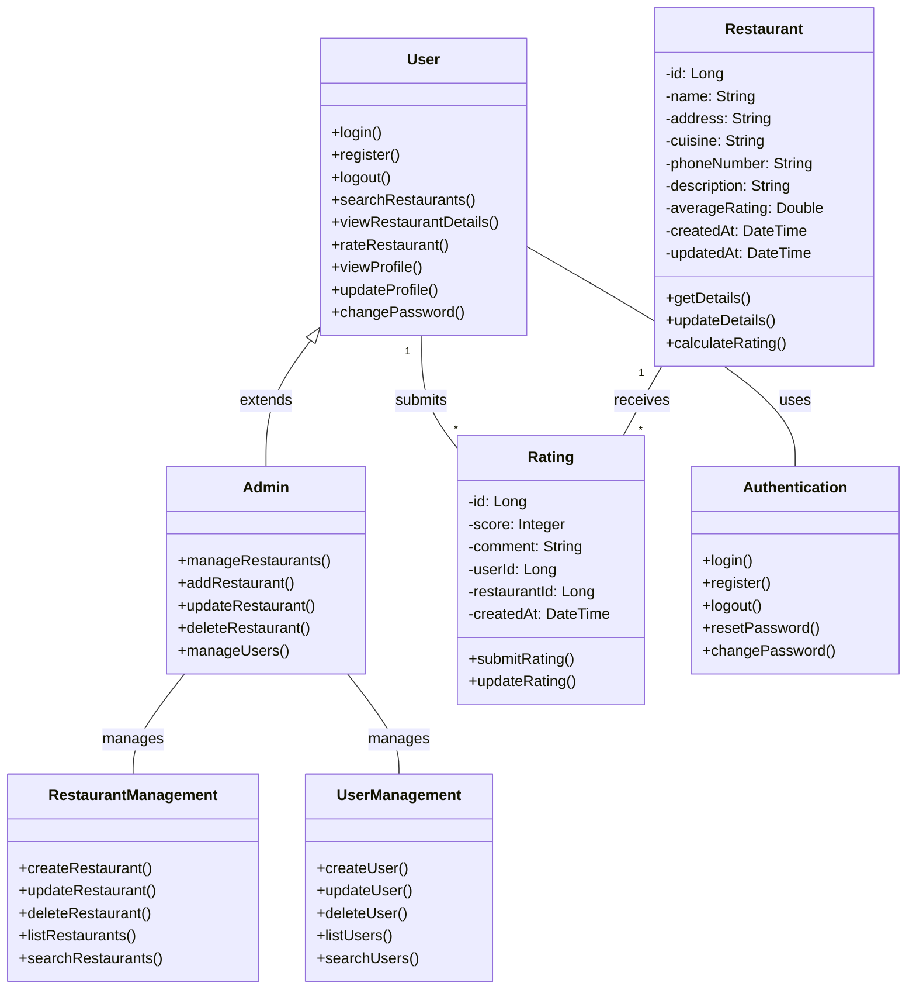

```mermaid
classDiagram
    class User {
        +login()
        +register()
        +logout()
        +searchRestaurants()
        +viewRestaurantDetails()
        +rateRestaurant()
        +viewProfile()
        +updateProfile()
        +changePassword()
    }

    class Admin {
        +manageRestaurants()
        +addRestaurant()
        +updateRestaurant()
        +deleteRestaurant()
        +manageUsers()
    }

    class Restaurant {
        -id: Long
        -name: String
        -address: String
        -cuisine: String
        -phoneNumber: String
        -description: String
        -averageRating: Double
        -createdAt: DateTime
        -updatedAt: DateTime
        +getDetails()
        +updateDetails()
        +calculateRating()
    }

    class Rating {
        -id: Long
        -score: Integer
        -comment: String
        -userId: Long
        -restaurantId: Long
        -createdAt: DateTime
        +submitRating()
        +updateRating()
    }

    class RestaurantManagement {
        +createRestaurant()
        +updateRestaurant()
        +deleteRestaurant()
        +listRestaurants()
        +searchRestaurants()
    }

    class UserManagement {
        +createUser()
        +updateUser()
        +deleteUser()
        +listUsers()
        +searchUsers()
    }

    class Authentication {
        +login()
        +register()
        +logout()
        +resetPassword()
        +changePassword()
    }

    User <|-- Admin : extends
    User "1" -- "*" Rating : submits
    Restaurant "1" -- "*" Rating : receives
    Admin -- RestaurantManagement : manages
    Admin -- UserManagement : manages
    User -- Authentication : uses
``` 